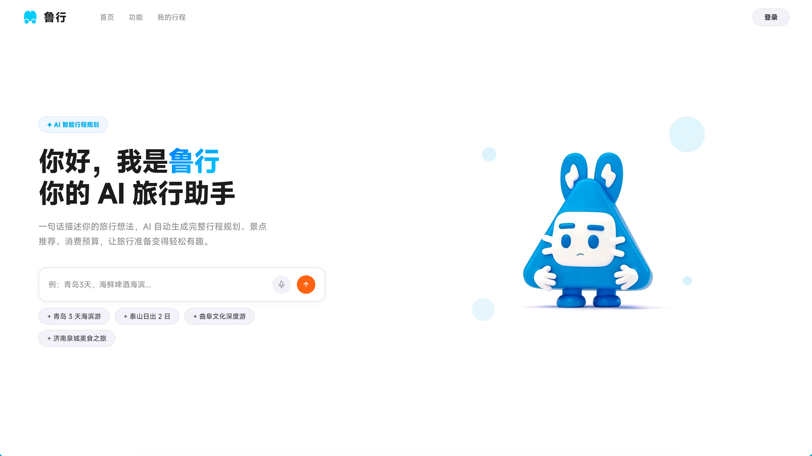

  

<h1 align="center">鲁行 · LuXing</h1>

  <strong>Plan smarter trips with one sentence.</strong> 
  一句话 · 一段旅程 · 一位贴身 AI 旅伴

  
  &nbsp;
  

  
  
  
  
  

  <a href="#-产品简介">产品简介</a> ·
  <a href="#-产品截图">产品截图</a> ·
  <a href="#-核心功能">核心功能</a> ·
  <a href="#-技术亮点">技术亮点</a> ·
  <a href="#-立即体验">立即体验</a> ·
  <a href="#-关于-innate-labs">关于 Innate Labs</a>

 

---

## ✨ 产品简介

**鲁行（LuXing）** 是一款专为现代旅行者打造的 **AI 智能旅行规划平台**。
只需一句话描述你的旅行想法 —— 想去哪儿、玩几天、喜欢什么 —— 鲁行便能自动生成完整的多天行程方案、景点推荐与消费预算，让旅行准备变得轻松有趣。

平台接入 **高德地图** 与 **维基百科**，提供真实可靠的景点评分与图片，并针对每个目的地展示详细攻略、周边美食住宿及一键导航服务。AI 还能同时生成多套不同风格的行程方案，帮助用户自由对比、灵活选择。

在旅途中，鲁行支持 **AI 语音记账**：说一句"刚才打车 28 块"，账目自动记录、分类、归档，告别繁琐手动输入。此外，平台还提供行程管理、景点顺序调整、实时天气查询、行李清单生成等贴心服务 —— 全流程覆盖旅行每一个环节。

> 💡 **一句话定义鲁行**：把"想去玩"和"已经出发"之间所有琐碎的事，交给 AI。

 

## 🎬 产品截图

  
   
  <b>🪄 一句话描述你的旅行想法，AI 自动生成完整行程规划</b>

 

## 🚀 核心功能

<table>
<tr>
<td width="50%" valign="top">

### 🧠 AI 智能行程规划

- **一句话生成行程** —— 输入"想去日本玩 5 天，喜欢小众景点和拉面"，AI 自动产出完整多天方案
- **多方案并行对比** —— 同时生成多套风格不同的行程，自由对比与组合
- **真实数据支撑** —— 景点评分、图片来自高德地图与维基百科，所见即所得
- **预算自动测算** —— 交通 / 住宿 / 餐饮 / 门票分类清晰，总预算一目了然

</td>
<td width="50%" valign="top">

### 🎤 AI 语音记账

- **一句话记一笔** —— 旅途中说"打车 28"，自动完成记录与分类
- **自动归类统计** —— 交通 / 餐饮 / 住宿 / 购物 / 门票自动分桶
- **告别手动输入** —— 双手解放，专注体验当下
- **消费可视化** —— 实时看到旅程总开销与单类占比

</td>
</tr>
<tr>
<td width="50%" valign="top">

### 🗺️ 全流程行程管理

- **景点顺序可调** —— 拖拽即可重排，AI 实时重算路线与时间
- **实时天气查询** —— 每日天气直接嵌入行程卡片
- **行李清单生成** —— 按目的地、季节、行程长度自动生成 packing list
- **一键导航** —— 跳转高德地图直接出发

</td>
<td width="50%" valign="top">

### 🍜 目的地深度攻略

- **真实景点信息** —— 评分、开放时间、门票、推荐时长
- **周边一站式** —— 附近美食、住宿、交通枢纽
- **背景知识** —— 维基百科的人文与历史介绍
- **用户笔记** —— 真实出行者的实战经验

</td>
</tr>
</table>

 

## 🧱 技术亮点

<table>
  <thead>
    <tr>
      <th align="left">模块</th>
      <th align="left">能力 / 数据源</th>
    </tr>
  </thead>
  <tbody>
    <tr>
      <td>🗺️ &nbsp;<b>地图与导航</b></td>
      <td><b>高德地图</b> · POI · 路线规划 · 实时导航</td>
    </tr>
    <tr>
      <td>📚 &nbsp;<b>内容数据</b></td>
      <td><b>维基百科</b> · 景点背景 · 人文介绍 · 图片素材</td>
    </tr>
    <tr>
      <td>🧠 &nbsp;<b>AI 行程规划</b></td>
      <td>大语言模型 + 真实数据 RAG，行程可落地不"画大饼"</td>
    </tr>
    <tr>
      <td>🎤 &nbsp;<b>语音记账</b></td>
      <td>语音识别 + 意图理解 + 自动分类，端到端低延迟</td>
    </tr>
    <tr>
      <td>☁️ &nbsp;<b>实时天气</b></td>
      <td>逐日天气服务接入，行程卡片直接呈现</td>
    </tr>
    <tr>
      <td>🎒 &nbsp;<b>行李清单</b></td>
      <td>规则引擎 × 目的地气候 × 行程类型 自动生成</td>
    </tr>
  </tbody>
</table>

 

## 🪐 立即体验

**🌐 官网体验：[luxing.chat](https://luxing.chat/web.html)**

无需安装 · 网页直达 · 一句话开始你的下一段旅程

 

## 🛸 关于 Innate Labs

<table>
<tr>
<td>

> **Building AI-native products & agents for the next generation of founders.**

[Innate Labs](https://github.com/Innate-Labs) 致力于打造下一代 AI 原生产品与智能体（Agents）。
**鲁行（LuXing）** 是我们在 **AI × 出行** 场景的最新探索 —— 让 AI 真正走进真实生活的每一个琐碎瞬间。

- 🌐 GitHub：<https://github.com/Innate-Labs>
- 🪐 产品官网：<https://luxing.chat/web.html>

</td>
</tr>
</table>

 

---

  
    © 2026 <a href="https://github.com/Innate-Labs"><b>Innate Labs</b></a> &nbsp;·&nbsp;
    Crafted with 🌊 and ✨ AI &nbsp;·&nbsp;
    <a href="https://luxing.chat/web.html">luxing.chat</a>
  

